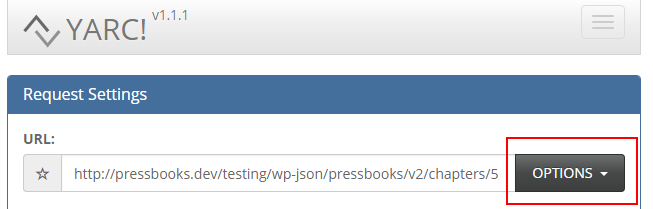
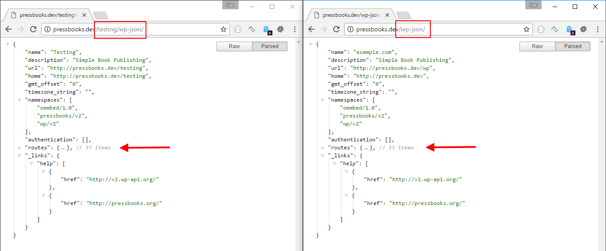
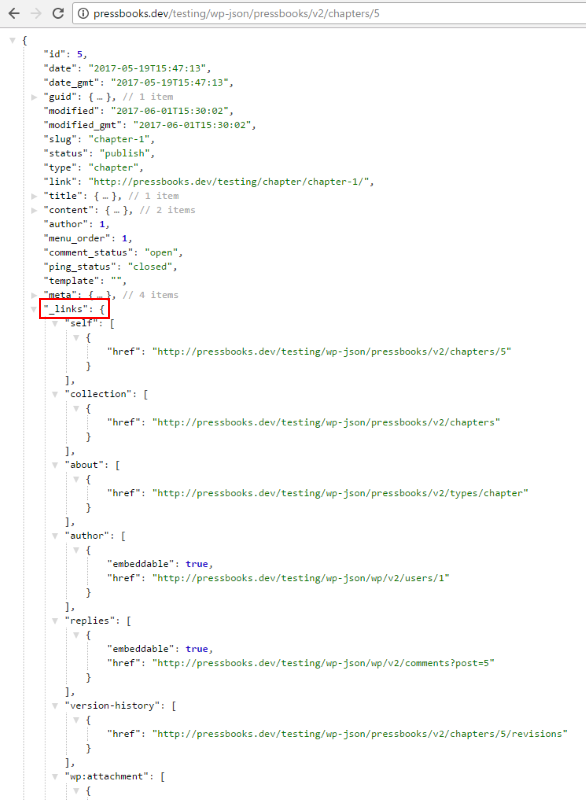
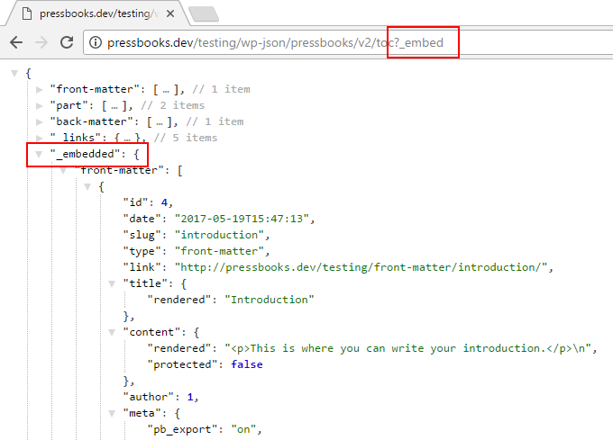
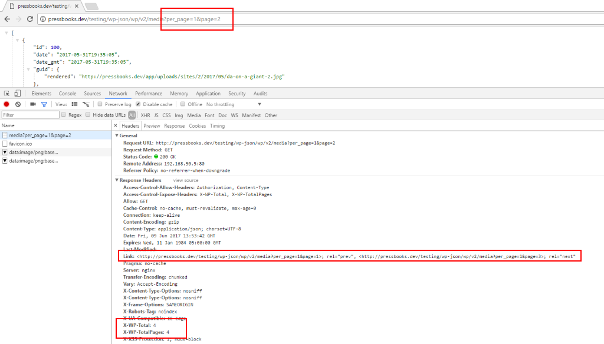

## Recommended Tools

 + [JSON Formatter](https://github.com/callumlocke/json-formatter)
 + [Yet Another REST Client](https://github.com/paulhitz/yet-another-rest-client)
 + [Basic Authentication Plugin (FastCGI Compatible Fork)](https://github.com/eventespresso/Basic-Auth)

### Troubleshooting

 + JSON Formatter: **CTRL/CMD+Click** a triangle to collapse/expand nodes at the same level.
 + YARC: When testing with Basic Authentication, make sure you are logged out of WordPress first.

## Getting Started

[WP API](https://developer.wordpress.org/rest-api/) supports all HTTP Methods: GET, POST, PUT, PATCH, DELETE, OPTIONS.

WP API respects permissions but the developer must [setup authentication](https://developer.wordpress.org/rest-api/using-the-rest-api/authentication/#authentication-plugins) separately.

### Schema

WP API is self-documenting. Send an OPTIONS request to any endpoint and get back [JSON Schema](http://json-schema.org/) compatible info on how to use it:



> To get the entire API schema in a single query, add `context=help` at the index. (Ie. http://site/book/wp-json?context=help )

### Multisite

Pressbooks has different API endpoints for book and the root site:



### Features

WP API items have a `_links` node based on [HAL](http://stateless.co/hal_specification.html) (Hypertext Application Language):



To reduce the number of HTTP requests use [the _embed parameter](https://developer.wordpress.org/rest-api/using-the-rest-api/global-parameters/#_embed) to tell the API that the response should include embeddable resources.



WP API exposes pagination info in the response header.



### PHP to JSON

WP API renders JSON in a generic way that does not match the DB columns. Keep calm and [RTFM](https://developer.wordpress.org/rest-api/reference/posts/):

```php
if ( ! empty( $schema['properties']['author'] ) ) {
    $data['author'] = (int) $post->post_author;
}
if ( ! empty( $schema['properties']['slug'] ) ) {
    $data['slug'] = $post->post_name;
}
if ( ! empty( $schema['properties']['content'] ) ) {
    $data['content'] = array(
        'rendered'  => post_password_required( $post ) ? '' : apply_filters( 'the_content', $post->post_content ),
        'protected' => (bool) $post->post_password,
    );
}
```

```json
{
  "author": 1,
  "slug": "chapter-1",
  "content": {
    "rendered": "<p>This is the first chapter in the main body of the text. You can change the text, rename the chapter, add new chapters, and add new parts.</p>",
    "protected": false
  }
}
```
